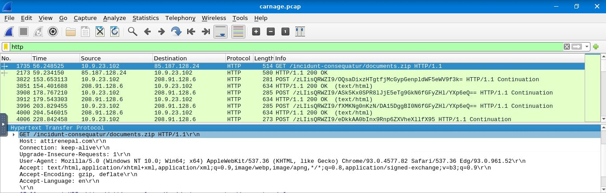
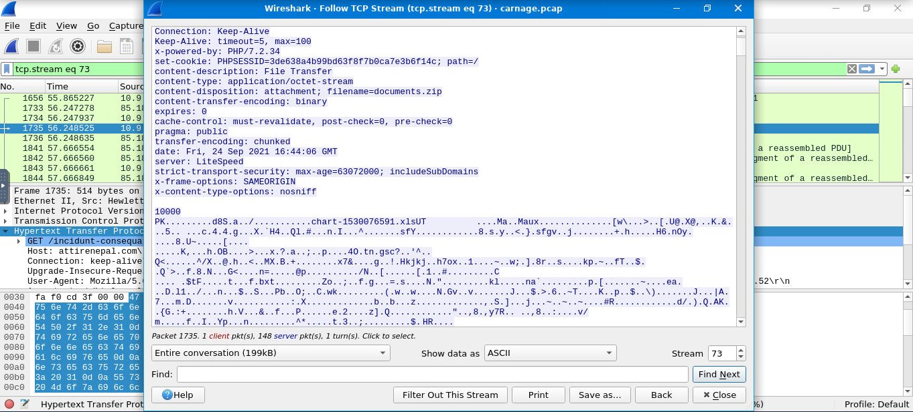
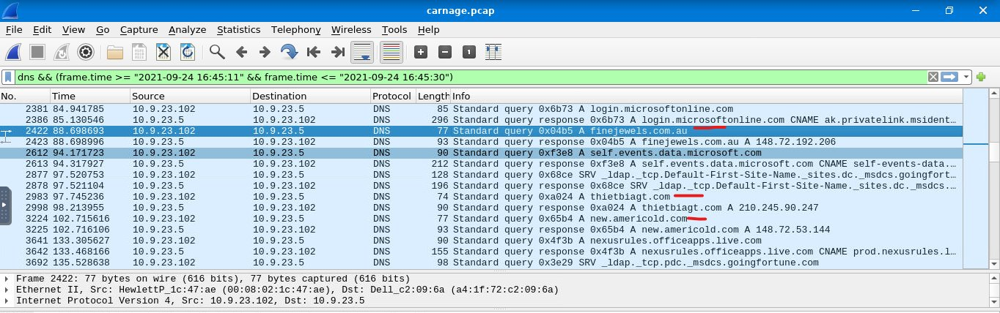
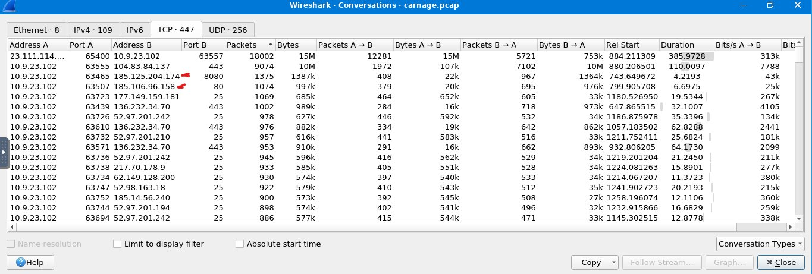
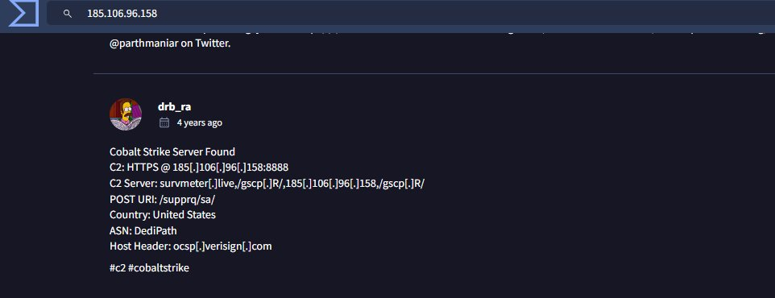
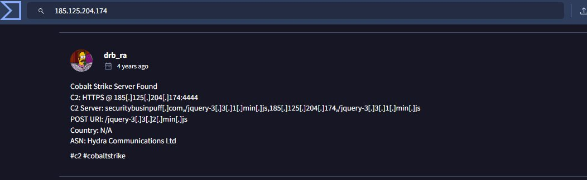

# Wireshark — Malicious Network Traffic Analysis

**Analyst:** Andy Dela Quarshie Wright  
**Role:** SOC Level 1 Analyst  
**Tool:** Wireshark  
**PCAP File:** carnage.pcap  

---

## Overview

Forensic packet analysis of a real-world network breach at Bartell Ltd. An employee in the Purchasing Department opened a malicious Word document, triggering an outbound connection to a Cobalt Strike C2 server. Using Wireshark, I analysed carnage.pcap to identify the malware delivery mechanism, attacker infrastructure, and subsequent malspam activity from the compromised host.

---

## Incident Summary

| Field | Detail |
|-------|--------|
| Organisation | Bartell Ltd |
| Affected Host | 10.9.23.102 |
| Affected Department | Purchasing |
| Initial Vector | Malicious Word document opened by employee |
| First Malicious Connection | 2021-09-24 16:44:06 GMT |
| Malware Type | Cobalt Strike |
| C2 Server 1 | 185.106.96.158 port 80 |
| C2 Server 2 | 185.125.204.174 port 8080 |
| Activity | Malware download, C2 beaconing, malspam |

---

## Investigation Walkthrough

### Step 1 — Filter HTTP Traffic and Identify Malicious Download

**Filter used:**
```
http
```

Packet 1735 — compromised host 10.9.23.102 sent a GET request to 85.187.128.24:

```
GET /incidunt-consequatur/documents.zip HTTP/1.1
Host: attirenepal.com
User-Agent: Mozilla/5.0 (Windows NT 10.0; Win64; x64) AppleWebKit/537.36
```

Malicious file downloaded: documents.zip



---

### Step 2 — Follow TCP Stream — Inspect File Transfer

Used Follow TCP Stream (tcp.stream eq 73) to inspect the full HTTP response.

Key headers from server response:
```
content-description: File Transfer
content-type: application/octet-stream
content-disposition: attachment; filename=documents.zip
date: Fri, 24 Sep 2021 16:44:06 GMT
server: LiteSpeed
```

Internal filename revealed: chart-1530076591.xlsUT



---

### Step 3 — Identify Malicious Domains via DNS

**Filter used:**
```
dns && (frame.time >= "2021-09-24 16:45:11" && frame.time <= "2021-09-24 16:45:30")
```

Three malicious domains identified:
- finejewels.com.au — resolved to 148.72.192.206
- thietbiagt.com — resolved to 210.245.90.247
- new.americold.com — resolved to 148.72.53.144



---

### Step 4 — Identify C2 Servers via Conversations

Used Statistics > Conversations > TCP tab to identify high-volume suspicious outbound connections.

Two Cobalt Strike C2 servers identified:
- 185.125.204.174 port 8080 — 1,375 packets, 1.38MB
- 185.106.96.158 port 80 — 1,074 packets, 997KB

Both showed sustained bidirectional traffic consistent with C2 beaconing.



---

### Step 5 — Confirm C2 Servers on VirusTotal

185.106.96.158 — Confirmed Cobalt Strike:
```
C2: HTTPS @ 185.106.96.158:8888
POST URI: /supprq/sa/
ASN: DediPath
```



185.125.204.174 — Confirmed Cobalt Strike:
```
C2: HTTPS @ 185.125.204.174:4444
POST URI: /jquery-3.3.2.min.js
ASN: Hydra Communications Ltd
```



---

## IOCs Extracted

| Type | Value |
|------|-------|
| Compromised host | 10.9.23.102 |
| Malicious server | 85.187.128.24 (attirenepal.com) |
| Downloaded file | documents.zip / chart-1530076591.xlsUT |
| Malicious domain 1 | finejewels.com.au |
| Malicious domain 2 | thietbiagt.com |
| Malicious domain 3 | new.americold.com |
| C2 server 1 | 185.106.96.158 port 80 (Cobalt Strike) |
| C2 server 2 | 185.125.204.174 port 8080 (Cobalt Strike) |
| First contact | 2021-09-24 16:44:06 GMT |
| Malware family | Cobalt Strike |

---

## MITRE ATT&CK Mapping

| Technique | ID | Description |
|-----------|-----|-------------|
| Spearphishing Attachment | T1566.001 | Malicious Word document via email |
| Ingress Tool Transfer | T1105 | documents.zip downloaded from attirenepal.com |
| Command and Control | T1071.001 | HTTP/HTTPS C2 beaconing to Cobalt Strike servers |
| Exfiltration Over C2 Channel | T1041 | Data sent via POST requests to C2 |

---

## Skills Demonstrated

- Wireshark display filters — HTTP, DNS, TCP stream isolation
- TCP stream following — full HTTP request/response inspection
- File transfer identification via content-disposition headers
- DNS query analysis to surface malicious domains
- Conversations statistics to identify C2 beaconing by traffic volume
- Threat intelligence cross-referencing via VirusTotal
- Cobalt Strike C2 infrastructure identification

---

